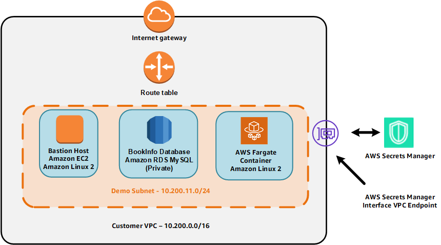

# Using AWS Secrets Manager with Amazon RDS and AWS Fargate - Scenario

This Secrets Manager Builder Session guides you through the use of **<a href="https://aws.amazon.com/secrets-manager/" target="_blank">AWS Secrets Manager</a>** with **<a href="https://aws.amazon.com/rds/" target="_blank">Amazon RDS</a>** and **<a href="https://aws.amazon.com/fargate/" target="_blank">AWS Fargate</a>**.  In the first phase of the Builder Session, you will access the RDS data base with Secrets Manager.  You will then use Secrets Manager to rotate the data base password.  You will then use Secrets Manager to access the data base again to show that you can continue to access the data base after the rotation.

In the second phase of the Builder Session, you will extend your use of Secrets Manager into an AWS Fargate container.  You will create an **<a href="https://docs.aws.amazon.com/AmazonECS/latest/developerguide/task_definitions.html" target="_blank">Amazon ECS task definition</a>** to pass secrets to the Fargate container and then launch the Fargate container.  You will then SSH into the container to show that the secret was passed to the container and that you can access the RDS data base.

* **Level**: 300
* **Duration**: one hour
* **<a href="https://awssecworkshops.com/getting-started/" target="_blank">Prerequisites</a>**:
    * AWS Account, Admin IAM User
    * Working knowledge of **<a href="https://aws.amazon.com/amazon-linux-2/" target="_blank">Amazon Linux 2</a>**
    * Working knowledge of both Docker and AWS Fargate
    * An SSH client for your workstation and the ability to initiate outbound SSH connections
* **<a href="https://www.nist.gov/cyberframework/online-learning/components-framework" target="_blank">CSF Functions</a>**: Prevent
* **<a href="https://d0.awsstatic.com/whitepapers/AWS_CAF_Security_Perspective.pdf" target="_blank">CAF Components</a>**: Preventative
* **AWS Services**: **<a href="https://aws.amazon.com/secrets-manager/" target="_blank">AWS Secrets Manager</a>**, **<a href="https://aws.amazon.com/rds/" target="_blank">Amazon RDS</a>**, **<a href="https://aws.amazon.com/fargate/" target="_blank">AWS Fargate</a>**

!!! info "Before you Begin"
    __Please review the architecture diagram below.__

## Workshop architecture

This environment consists of a VPC with two subnets.  The subnets containts an Amazon EC2 bastion host running Amazon Linux 2 used for running AWS CLI commands and a private, not publicly-accessible, Amazon RDS MySQL database instance.  The subnets are chosen based on the availability of an interface VPC endpoint for AWS Secrets Manager.  The VPC also contains an AWS Fargate container running the Amazon Linux 2 operating system.  In the RDS and Fargate phases of the workshop, you will learn how to use AWS Secrets Manager to access the RDS database from both a standard EC2 instance and the Fargate container.
